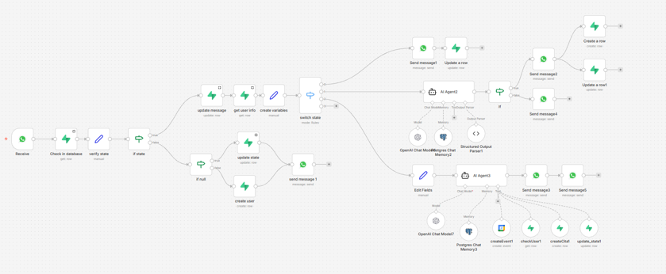

# LIA - AI-Powered Virtual Assistant 🤖

## Descripción
LIA es un asistente virtual inteligente para WhatsApp orquestado con n8n, OpenAI y Supabase para automatizar la atención al cliente y gestión de citas. Este proyecto procesa consultas complejas de usuarios en tiempo real mediante Inteligencia Artificial y flujos automatizados.

## 🛠 Stack Tecnológico
* **Orquestación:** n8n (Workflow Automation)
* **Inteligencia Artificial:** OpenAI API
* **Base de Datos / Backend:** Supabase (PostgreSQL)
* **Canal de Comunicación:** WhatsApp Business API

## ⚙️ Arquitectura y Flujo de Trabajo
1. **Recepción (Webhook):** n8n recibe los mensajes entrantes a través de la API de WhatsApp mediante un Webhook.
2. **Procesamiento y Contexto:** El flujo consulta a Supabase para verificar si el usuario tiene un historial previo y mantener el contexto de la conversación.
3. **Generación de Respuesta (IA):** El prompt y el historial se envían al modelo de GPT para generar una respuesta natural y precisa.
4. **Respuesta y Almacenamiento:** La respuesta se envía al usuario vía WhatsApp y el registro se guarda en Supabase.

## 📸 Vista del Flujo en n8n

## 📂 Estructura del Repositorio
* `lia_1_2.json`: Archivo exportado del flujo de n8n listo para ser importado en cualquier instancia.
* `database/`: Carpeta con los scripts SQL que contienen los esquemas de las tablas de Supabase.
* `images/`: Recursos gráficos y capturas del flujo.